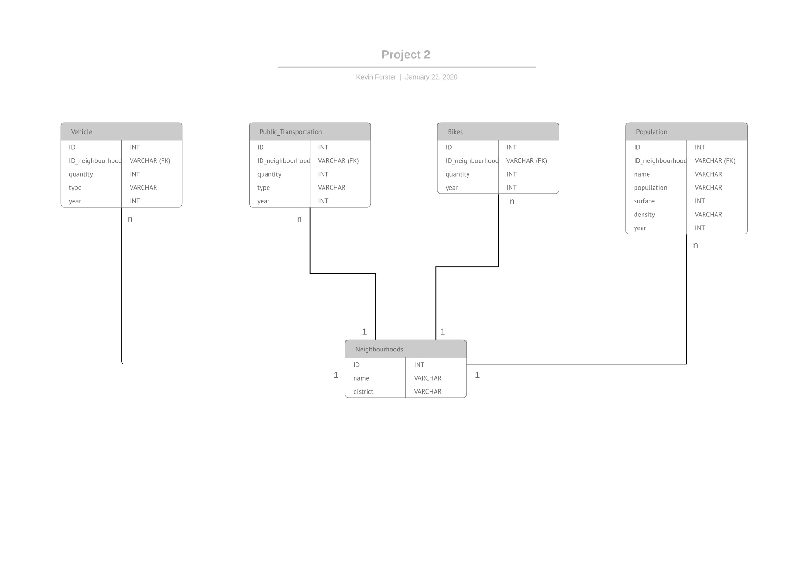

# Development of the transport system in Barcelona
*[Miguel Granica, Kevin Forster]*

*[Data Analytics, Barcelona & 24.1.2020]*

## Content
- [Project Description](#project-description)
- [Questions & Hypotheses](#questions-hypotheses)
- [Dataset](#dataset)
- [Database](#database)
- [Workflow](#workflow)
- [Organization](#organization)
- [Links](#links)

## Project Description
In this project we looked at the development of the transport system in Barcelon. A studie Ajuntament de Barcelona [Link](https://www.barcelona.cat/mobilitat/sites/default/files/documents/pmu_sintesi_catala.pdf) shows on one side an increase of walking and the use of bikes or public transport in Barcelona. On the other side the use of vehicles is supposed to decrease. 

## Questions & Hypotheses
We defined different hypotheses during our project
- How many people use which kind of transportation in BCN
- How many people use the Bicing in Barcelona?
- How ecological are the eBikes and how many people use it?
- How has the use of transportation changed in the last 3 years in Barcelona?
- Is there any difference to notice in the neighbourhood of BCN
- Are people sharing their cars?
- Age of the drivers?
- How many accidents are caused in BCN yearly? And where?
- What is the relation in the use public transport to the use of private vehicles?
...

## Dataset

Hypotheses
https://www.barcelona.cat/mobilitat/sites/default/files/documents/pmu_sintesi_catala.pdf
Types of vehicles 
- https://opendata-ajuntament.barcelona.cat/data/en/dataset/est-vehicles-tipus-propietari-motos
- https://opendata-ajuntament.barcelona.cat/data/en/dataset/est-vehicles-tipus-propietari-turismes 
Data neighbourhood
- https://opendata-ajuntament.barcelona.cat/data/es/dataset/estacions-bus/resource/2d190658-93ac-4c43-a23f-c5d313b1ae9c
- https://opendata-ajuntament.barcelona.cat/data/es/dataset/bicing
- https://opendata-ajuntament.barcelona.cat/data/es/dataset/transports/resource/e07dec0d-4aeb-40f3-b987-e1f35e088ce2
Population 
- https://opendata-ajuntament.barcelona.cat/data/es/dataset/est-densitat

## Database
 
Or you can also use the following link: https://www.lucidchart.com/invitations/accept/66873071-f1d0-4b1b-a0cc-a680fb98c212

## Workflow
We first planned our project by creating tickets in Trello (see link below). Then we both researched for interesting topics and also for data. Once we had the data and an intersting topic we defined the project goal together. At the end of our project we compared our results, discussed them and used it for the presentation

## Organization
We used MySQL in SequelPro and Workbench. We created the database together, before we shared it and then each of us was able to work on it. 
In the folder you will find the SQL document and the database we used. 

## Links
Include links to your repository, slides and kanban board. Feel free to include any other links associated with your project.

[Repository](https://github.com/kevforster/Project-Week-2-Barcelona)  
[Slides](https://docs.google.com/presentation/d/1CXAd9KxXek-5J3bvBeLOqiHbbhMrriUQ4gUuwJV6UU0/edit?usp=sharing)  
[Trello](https://trello.com/b/ASvLlwH9/project-2-development-of-the-transportation-system-in-barcelona)  
